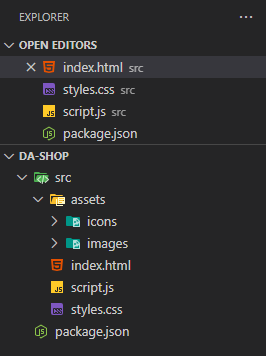

# Project initialization of the DA-Shop

<!-- TOC -->

- [Description](#description)
- [Initial project setup](#initial-project-setup)
  - [Initialize project with npm](#initialize-project-with-npm)
  - [Creating the project folders and files](#creating-the-project-folders-and-files)
  - [Install the npn packages Tailwind, daisyUI an json-server](#install-the-npn-packages-tailwind-daisyui-an-json-server)
  - [Install biome.js as linting tool](#install-biomejs-as-linting-tool)
- [The first start of our project](#the-first-start-of-our-project)
- [Create git repository](#create-git-repository)
- [Links](#links)

<!-- /TOC -->

---

## Description

This file records the development steps of the DA store. This overview is intended to help you understand how the individual parts of the project were created.

---

## Initial project setup

### Initialize project with npm

- create a new folder on your hard disk and give it a meaningful name (e.g. `da-shop`)
- Open your command line and navigate to the created order. Now you can enter the following command to initialize
the project_

  ```bash
  npm init
  ```

  Now we are asked to provide some information about our project.
  ./readme-assets/npm-init.png
  

  A new file was created in our project folder: `package.json` with the following content:

  ```json
  {
    "name": "da-shop",
    "version": "1.0.0",
    "description": "Our community project to review and reinforce JavaScript programming concepts",
    "main": "index.js",
    "scripts": {
      "test": "echo \"Error: no test specified\" && exit 1"
    },
    "keywords": [
      "JavaScript",
      "Community"
    ],
    "author": "Developer Akademie participants",
    "license": "MIT"
  }
  ```

### Creating the project folders and files

- Create a new folder called `src`. This folder will later contain our project code.
- Create the following folders in this `src` Folder
  - `assets/img`
  - `assets/icons`
- create the following files in the `src`folder
  - `script.js`
  - `styles.css`
  - `index.html`
    - Insert the HTML basic structure into this page
    - Link both the `styles.css` and the `script.js` file in the head section of the `index.html` file
- The project folder should now look like this:

  

### Install the npn packages Tailwind, daisyUI an json-server

- Install the mentioned packages with the command line

  ```bash
  npm install tailwindcss @tailwindcss/cli  daisyui@latest json-server
  ```

- Set up Tailwind and daisyUI
  - Create the `input.css` file in the main directory of the project
  - Edit this file to:

    ```css
    @import "tailwindcss";

    @plugin "daisyui";
    ```

- Set up json-server
  - Create a folder `backend`
  - In this folder create the `db.json` file
    - Edit the `db.json` file

      ```json
      { }
      ```

- Open your `package.json` file and change the `"scripts"` section to:

  ```json
  {
    // ... more code
   "scripts": {
      "dev": "tailwindcss -i ./input.css -o ./src/styles.css --watch",
      "backend": "json-server --watch backend/db.json",
      "build": "tailwindcss -i ./input.css -o ./src/styles.css"
    },
    // ... more code
  }
  ```

  - Here we set up various scripts to start functionalities for tailwind and our json server with the n(ode) p(ackage) m(anager).
    - `"dev"` This command ensures that the tailwind CSS classes we use are correctly transferred to our styles.css.
    The `--watch` at the end ensures that the corresponding files are continuously monitored and that the page is also
    updated in our browser every time the code is changed.
    - `"backend"` Ensures that the json server is started and continuously supplies us with data from the
    jsons that we will create later via `--watch`. By default, this “server” can be accessed at `http://localhost:3000`

### Install biome.js as linting tool

A linting tool is a static code analysis tool that checks a program's source code for potential errors, stylistic issues, and deviations from coding standards. It helps developers improve code quality, enhance readability, and prevent common mistakes before the code is even executed.

- Make you have the Biome extention installed in your VSCode ([Biome extention](https://marketplace.visualstudio.com/items?itemName=biomejs.biome))

- Install biome.js

  ```bash
  npm i -D -E @biomejs/biome
  ```

- Initialize Biome

  ```bash
  npx @biomejs/biome init
  ```

- Configure Biome

  Open the `biome.json` file and replace the content with:

  ```json
  {
    "assist": { "actions": { "source": { "organizeImports": "on" } } },
    "formatter": {
        "enabled": true,
        "indentStyle": "space",
        "indentWidth": 4,
        "lineWidth": 120
    },
    "linter": {
        "enabled": true,
        "rules": {
            "recommended": true,
            "style": {
                "useImportType": "off",
                "useNamingConvention": {
                    "level": "error",
                    "options": {
                        "strictCase": false,
                        "conventions": [
                            {
                                "selector": {
                                    "kind": "const",
                                    "scope": "any"
                                },
                                "formats": ["CONSTANT_CASE"]
                            },
                            {
                                "selector": {
                                    "kind": "typeProperty"
                                },
                                "formats": ["camelCase", "snake_case"]
                            }
                        ]
                    }
                },
                "noUselessElse": "off",
                "noParameterAssign": "error",
                "useAsConstAssertion": "error",
                "useDefaultParameterLast": "error",
                "useEnumInitializers": "error",
                "useSelfClosingElements": "error",
                "useSingleVarDeclarator": "error",
                "noUnusedTemplateLiteral": "error",
                "useNumberNamespace": "error",
                "noInferrableTypes": "error",
                "useConsistentArrayType": { "level": "error", "options": { "syntax": "shorthand" } }
            },
            "suspicious": {
                "noEmptyBlock": "error",
                "noEmptyBlockStatements": "error",
                "noConsole": { "level": "error", "options": { "allow": ["log"] } }
            },
            "correctness": {
                "noUnusedFunctionParameters": "error",
                "noUnusedVariables": "error",
                "noUnusedImports": "error"
            },
            "complexity": {
                "noUselessUndefinedInitialization": "error",
                "useLiteralKeys": "off"
            }
        }
    },
    "javascript": {
        "formatter": {
            "quoteStyle": "single",
            "trailingCommas": "es5"
        }
    },
    "files": {
        "includes": [
            "**/*.html",
            "**/src/**/*.ts",
            "**/src/**/*.js",
            "**/src/**/*.html",
            "**/src/**/*.css",
            "**/src/**/*.json",
            "**/src/**/*.scss",
            "**/src/**/*.jsx",
            "**/src/**/*.tsx",
            "!**/src/assets",
            "!**/node_modules",
            "!**/dist"
        ]
    }
  }
  ```

---

## The first start of our project

The project is now ready for the first start

- Open a command line window and “start” Tailwind

  ```bash
  npm run dev
  ```

- Start a second command line window and start the “backend”, which will later provide us with data like an API.

  ```bash
  npm run backend
  ```

- Start the actual web server, which ensures that we can see and monitor our page in the web browser via the
“Live Server” plugin in VSCode.

---

## Create git repository

Create a repository on GitHub using the procedure you are familiar with.

---

## Links

- [Live Server Plugin](https://marketplace.visualstudio.com/items?itemName=ritwickdey.LiveServer)
- [Tailwind](https://tailwindcss.com/)
- [daisyUI](https://daisyui.com/)
- [json-server](https://github.com/typicode/json-server/tree/main)
- [Biome](https://biomejs.dev/)
- [github](https://github.com/)
