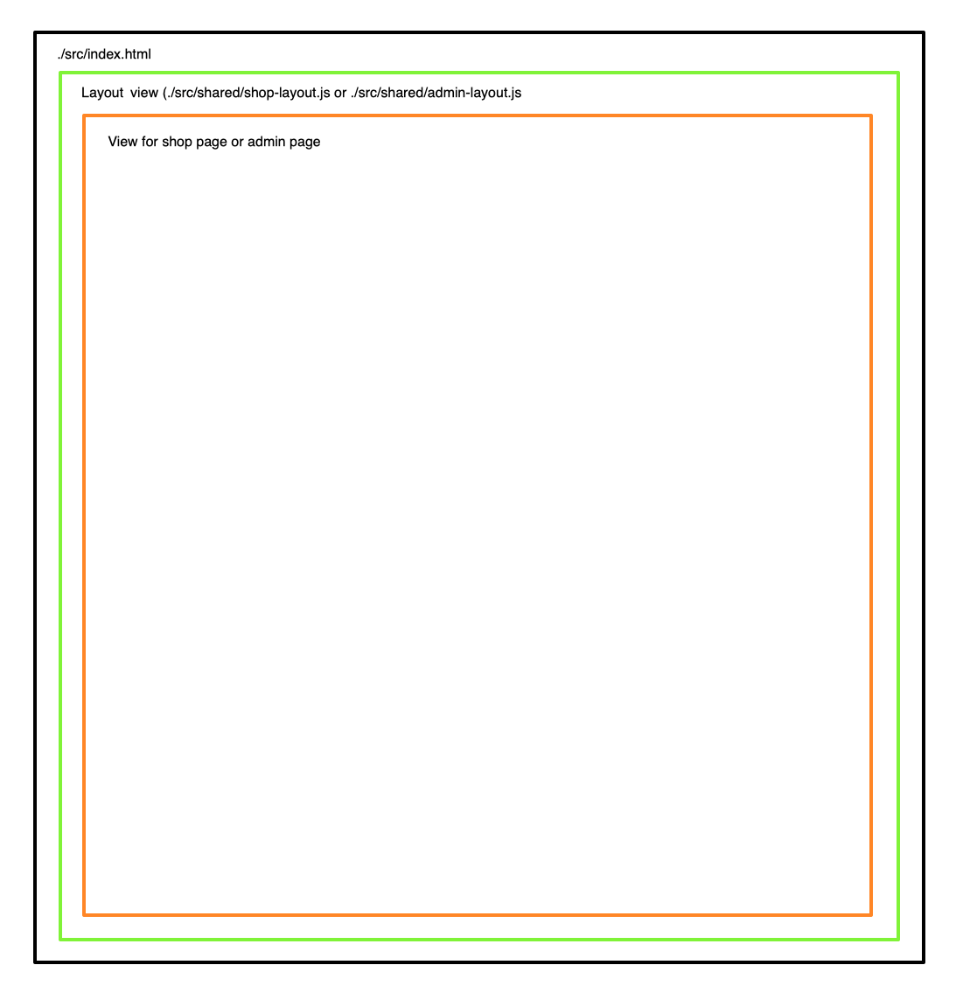

# Create admin area with routes

- [Introduction](#introduction)
- [Adjustment of the development server](#adjustment-of-the-development-server)
- [Implementation admin area with different layout](#implementation-admin-area-with-different-layout)
  - [Creating layout files for the shop and admin area](#creating-layout-files-for-the-shop-and-admin-area)
    - [Creating layout file for shop area](#creating-layout-file-for-shop-area)
    - [Creating layout file for admin area](#creating-layout-file-for-admin-area)
  - [Integration of layout files into our application](#integration-of-layout-files-into-our-application)
    - [Modification `./src/script.js`](#modification-srcscriptjs)
    - [Edit the main `./src/index.html` file](#edit-the-main-srcindexhtml-file)
    - [Summary – What exactly is happening here?](#summary-%E2%80%93-what-exactly-is-happening-here)

## Introduction

The shop is to be managed in the admin area. In the long term, the following features are to be made available here:

- Dashboard for quick and clear access to collected data. This includes how many orders have been placed, how many customers have registered, sales figures and much more.
- Shop articles management
- Customer management
- Management of access authorisations for the admin area
- and more

This area should have its own navigation and, if necessary, its own styling.

## Adjustment of the development server

A few errors crept into the configuration of our development server, and we can still improve the server somewhat. Edit the `./bs-config.json` file

```diff
    {
+       "port": 5500,
+       "files": ["./src/**/*.{html,htm,css,js}"],
        "server": {
-           "port": 5500,
            "baseDir": "./src",
            "routes": {
+               "/products/:id": "index.html"
+           }
+       },
        "ui": {
            "port": 5501
        }
+   }
```

## Implementation admin area with different layout

### Creating layout files for the shop and admin area

In order to be able to use different layouts with different header areas and other customisations in the shop and admin area, we need to create two layout files that determine the basic layout of the respective area.

#### Creating layout file for shop area

- create a new folder and file in `./src/shared/shop-layout.js`
- fill the brand new file with:

```js
// ./src/shared/shop-layout.js

import AbstractView from '../views/AbstractView.js';

export default class extends AbstractView {

    constructor() {
        super();
        this.setTitle('Home | DA Shop');
    }

    async getHTML() {
        return /*html*/ `
            <header class="navbar bg-base-200 shadow-sm">
                <div class="w-full max-w-480 flex justify-between items-center mx-auto px-8">
                    <div class="flex-1">
                        <a class="text-xl">da Shop</a>
                    </div>

                    <nav>
                        <label id="mobile-menu-toggle" class="btn btn-circle swap swap-rotate 576:hidden">
                            <input type="checkbox" id="mobile-menu-checkbox" />

                            <svg class="swap-off fill-current" xmlns="http://www.w3.org/2000/svg" width="32" height="32"
                                viewBox="0 0 512 512">
                                <path d="M64,384H448V341.33H64Zm0-106.67H448V234.67H64ZM64,128v42.67H448V128Z" />
                            </svg>

                            <svg class="swap-on fill-current" xmlns="http://www.w3.org/2000/svg" width="32" height="32"
                                viewBox="0 0 512 512">
                                <polygon
                                    points="400 145.49 366.51 112 256 222.51 145.49 112 112 145.49 222.51 256 112 366.51 145.49 400 256 289.49 366.51 400 400 366.51 289.49 256 400 145.49" />
                            </svg>
                        </label>
                    </nav>

                    <div id="mobile-menu"
                        class="fixed inset-0 bg-base-200 z-50 flex flex-col justify-center items-center transform translate-x-full transition-transform duration-300 ease-in-out 576:hidden">

                        <button id="mobile-menu-close" class="absolute top-4 right-4 btn btn-circle btn-ghost">
                            <svg xmlns="http://www.w3.org/2000/svg" width="24" height="24" viewBox="0 0 512 512" class="fill-current">
                                <polygon
                                    points="400 145.49 366.51 112 256 222.51 145.49 112 112 145.49 222.51 256 112 366.51 145.49 400 256 289.49 366.51 400 400 366.51 289.49 256 400 145.49" />
                            </svg>
                        </button>

                        <nav class="flex flex-col items-center space-y-8">
                            <a href="./" data-link class="text-2xl font-semibold hover:text-primary transition-colors">Home</a>
                            <a href="./products" data-link class="text-2xl font-semibold hover:text-primary transition-colors">Products</a>
                            <a href="./about" data-link class="text-2xl font-semibold hover:text-primary transition-colors">About</a>
                            <a href="./contact" data-link class="text-2xl font-semibold hover:text-primary transition-colors">Contact</a>

                            <!-- Theme Toggle for Mobile -->
                            <label class="swap swap-rotate">
                                <input type="checkbox" class="theme-controller" value="synthwave" />

                                <svg class="swap-off h-8 w-8 fill-current" xmlns="http://www.w3.org/2000/svg" viewBox="0 0 24 24">
                                    <path
                                        d="M5.64,17l-.71.71a1,1,0,0,0,0,1.41,1,1,0,0,0,1.41,0l.71-.71A1,1,0,0,0,5.64,17ZM5,12a1,1,0,0,0-1-1H3a1,1,0,0,0,0,2H4A1,1,0,0,0,5,12Zm7-7a1,1,0,0,0,1-1V3a1,1,0,0,0-2,0V4A1,1,0,0,0,12,5ZM5.64,7.05a1,1,0,0,0,.7.29,1,1,0,0,0,.71-.29,1,1,0,0,0,0-1.41l-.71-.71A1,1,0,0,0,4.93,6.34Zm12,.29a1,1,0,0,0,.7-.29l.71-.71a1,1,0,1,0-1.41-1.41L17,5.64a1,1,0,0,0,0,1.41A1,1,0,0,0,17.66,7.34ZM21,11H20a1,1,0,0,0,0,2h1a1,1,0,0,0,0-2Zm-9,8a1,1,0,0,0-1,1v1a1,1,0,0,0,2,0V20A1,1,0,0,0,12,19ZM18.36,17A1,1,0,0,0,17,18.36l.71.71a1,1,0,0,0,1.41,0,1,1,0,0,0,0-1.41ZM12,6.5A5.5,5.5,0,1,0,17.5,12,5.51,5.51,0,0,0,12,6.5Zm0,9A3.5,3.5,0,1,1,15.5,12,3.5,3.5,0,0,1,12,15.5Z" />
                                </svg>

                                <svg class="swap-on h-8 w-8 fill-current" xmlns="http://www.w3.org/2000/svg" viewBox="0 0 24 24">
                                    <path
                                        d="M21.64,13a1,1,0,0,0-1.05-.14,8.05,8.05,0,0,1-3.37.73A8.15,8.15,0,0,1,9.08,5.49a8.59,8.59,0,0,1,.25-2A1,1,0,0,0,8,2.36,10.14,10.14,0,1,0,22,14.05,1,1,0,0,0,21.64,13Zm-9.5,6.69A8.14,8.14,0,0,1,7.08,5.22v.27A10.15,10.15,0,0,0,17.22,15.63a9.79,9.79,0,0,0,2.1-.22A8.11,8.11,0,0,1,12.14,19.73Z" />
                                </svg>
                            </label>
                        </nav>
                    </div>

                    <nav class="flex-none hidden 576:block">
                        <ul class="menu menu-horizontal items-center py-0 px-1">
                            <li><a href="./" data-link>Home</a></li>
                            <li><a href="./products" data-link>Products</a></li>
                            <li><a href="./about" data-link>About</a></li>
                            <li><a href="./contact" data-link>Contact</a></li>
                            <li>
                                <label class="swap swap-rotate">
                                    <input type="checkbox" class="theme-controller" value="synthwave" />

                                    <!-- sun icon -->
                                    <svg class="swap-off h-7 w-7 fill-current" xmlns="http://www.w3.org/2000/svg" viewBox="0 0 24 24">
                                        <path
                                            d="M5.64,17l-.71.71a1,1,0,0,0,0,1.41,1,1,0,0,0,1.41,0l.71-.71A1,1,0,0,0,5.64,17ZM5,12a1,1,0,0,0-1-1H3a1,1,0,0,0,0,2H4A1,1,0,0,0,5,12Zm7-7a1,1,0,0,0,1-1V3a1,1,0,0,0-2,0V4A1,1,0,0,0,12,5ZM5.64,7.05a1,1,0,0,0,.7.29,1,1,0,0,0,.71-.29,1,1,0,0,0,0-1.41l-.71-.71A1,1,0,0,0,4.93,6.34Zm12,.29a1,1,0,0,0,.7-.29l.71-.71a1,1,0,1,0-1.41-1.41L17,5.64a1,1,0,0,0,0,1.41A1,1,0,0,0,17.66,7.34ZM21,11H20a1,1,0,0,0,0,2h1a1,1,0,0,0,0-2Zm-9,8a1,1,0,0,0-1,1v1a1,1,0,0,0,2,0V20A1,1,0,0,0,12,19ZM18.36,17A1,1,0,0,0,17,18.36l.71.71a1,1,0,0,0,1.41,0,1,1,0,0,0,0-1.41ZM12,6.5A5.5,5.5,0,1,0,17.5,12,5.51,5.51,0,0,0,12,6.5Zm0,9A3.5,3.5,0,1,1,15.5,12,3.5,3.5,0,0,1,12,15.5Z" />
                                    </svg>

                                    <!-- moon icon -->
                                    <svg class="swap-on h-7 w-7 fill-current" xmlns="http://www.w3.org/2000/svg" viewBox="0 0 24 24">
                                        <path
                                            d="M21.64,13a1,1,0,0,0-1.05-.14,8.05,8.05,0,0,1-3.37.73A8.15,8.15,0,0,1,9.08,5.49a8.59,8.59,0,0,1,.25-2A1,1,0,0,0,8,2.36,10.14,10.14,0,1,0,22,14.05,1,1,0,0,0,21.64,13Zm-9.5,6.69A8.14,8.14,0,0,1,7.08,5.22v.27A10.15,10.15,0,0,0,17.22,15.63a9.79,9.79,0,0,0,2.1-.22A8.11,8.11,0,0,1,12.14,19.73Z" />
                                    </svg>
                                </label>
                            </li>
                        </ul>
                    </nav>
                </div>
            </header>

            <main id="content" class="w-full max-w-480 flex flex-col flex-1 gap-2 mx-auto p-8">

            </main>

            <footer class="footer sm:footer-horizontal footer-center bg-base-300 text-base-content p-4">
                <aside>
                    <p>Copyright © {new Date().getFullYear()} - All right reserved by ACME Industries Ltd</p>
                </aside>
            </footer>
        `;
    }
}
```

#### Creating layout file for admin area

- create a new folder and file in `./src/shared/admin-layout.js`
- fill the brand new file with:

```js
// ./src/shared/admin-layout.js

import AbstractView from '../views/AbstractView.js';

export default class extends AbstractView {

    constructor() {
        super();
        this.setTitle('Home | DA Shop');
    }

    async getHTML() {
        return /*html*/ `
            <header class="navbar bg-base-200 shadow-sm">
                <div class="w-full max-w-480 flex justify-between items-center mx-auto px-8">
                    <div class="flex-1">
                        <a class="text-xl">da Shop</a>
                    </div>

                    <nav>
                        <label id="mobile-menu-toggle" class="btn btn-circle swap swap-rotate 576:hidden">
                            <input type="checkbox" id="mobile-menu-checkbox" />

                            <svg class="swap-off fill-current" xmlns="http://www.w3.org/2000/svg" width="32" height="32"
                                viewBox="0 0 512 512">
                                <path d="M64,384H448V341.33H64Zm0-106.67H448V234.67H64ZM64,128v42.67H448V128Z" />
                            </svg>

                            <svg class="swap-on fill-current" xmlns="http://www.w3.org/2000/svg" width="32" height="32"
                                viewBox="0 0 512 512">
                                <polygon
                                    points="400 145.49 366.51 112 256 222.51 145.49 112 112 145.49 222.51 256 112 366.51 145.49 400 256 289.49 366.51 400 400 366.51 289.49 256 400 145.49" />
                            </svg>
                        </label>
                    </nav>

                    <div id="mobile-menu"
                        class="fixed inset-0 bg-base-200 z-50 flex flex-col justify-center items-center transform translate-x-full transition-transform duration-300 ease-in-out 576:hidden">

                        <button id="mobile-menu-close" class="absolute top-4 right-4 btn btn-circle btn-ghost">
                            <svg xmlns="http://www.w3.org/2000/svg" width="24" height="24" viewBox="0 0 512 512" class="fill-current">
                                <polygon
                                    points="400 145.49 366.51 112 256 222.51 145.49 112 112 145.49 222.51 256 112 366.51 145.49 400 256 289.49 366.51 400 400 366.51 289.49 256 400 145.49" />
                            </svg>
                        </button>

                        <nav class="flex flex-col items-center space-y-8">
                            <a href="./" data-link class="text-2xl font-semibold hover:text-primary transition-colors">Home</a>
                            <a href="./products" data-link class="text-2xl font-semibold hover:text-primary transition-colors">Products</a>
                            <a href="./about" data-link class="text-2xl font-semibold hover:text-primary transition-colors">About</a>
                            <a href="./contact" data-link class="text-2xl font-semibold hover:text-primary transition-colors">Contact</a>

                            <!-- Theme Toggle for Mobile -->
                            <label class="swap swap-rotate">
                                <input type="checkbox" class="theme-controller" value="synthwave" />

                                <svg class="swap-off h-8 w-8 fill-current" xmlns="http://www.w3.org/2000/svg" viewBox="0 0 24 24">
                                    <path
                                        d="M5.64,17l-.71.71a1,1,0,0,0,0,1.41,1,1,0,0,0,1.41,0l.71-.71A1,1,0,0,0,5.64,17ZM5,12a1,1,0,0,0-1-1H3a1,1,0,0,0,0,2H4A1,1,0,0,0,5,12Zm7-7a1,1,0,0,0,1-1V3a1,1,0,0,0-2,0V4A1,1,0,0,0,12,5ZM5.64,7.05a1,1,0,0,0,.7.29,1,1,0,0,0,.71-.29,1,1,0,0,0,0-1.41l-.71-.71A1,1,0,0,0,4.93,6.34Zm12,.29a1,1,0,0,0,.7-.29l.71-.71a1,1,0,1,0-1.41-1.41L17,5.64a1,1,0,0,0,0,1.41A1,1,0,0,0,17.66,7.34ZM21,11H20a1,1,0,0,0,0,2h1a1,1,0,0,0,0-2Zm-9,8a1,1,0,0,0-1,1v1a1,1,0,0,0,2,0V20A1,1,0,0,0,12,19ZM18.36,17A1,1,0,0,0,17,18.36l.71.71a1,1,0,0,0,1.41,0,1,1,0,0,0,0-1.41ZM12,6.5A5.5,5.5,0,1,0,17.5,12,5.51,5.51,0,0,0,12,6.5Zm0,9A3.5,3.5,0,1,1,15.5,12,3.5,3.5,0,0,1,12,15.5Z" />
                                </svg>

                                <svg class="swap-on h-8 w-8 fill-current" xmlns="http://www.w3.org/2000/svg" viewBox="0 0 24 24">
                                    <path
                                        d="M21.64,13a1,1,0,0,0-1.05-.14,8.05,8.05,0,0,1-3.37.73A8.15,8.15,0,0,1,9.08,5.49a8.59,8.59,0,0,1,.25-2A1,1,0,0,0,8,2.36,10.14,10.14,0,1,0,22,14.05,1,1,0,0,0,21.64,13Zm-9.5,6.69A8.14,8.14,0,0,1,7.08,5.22v.27A10.15,10.15,0,0,0,17.22,15.63a9.79,9.79,0,0,0,2.1-.22A8.11,8.11,0,0,1,12.14,19.73Z" />
                                </svg>
                            </label>
                        </nav>
                    </div>

                    <nav class="flex-none hidden 576:block">
                        <ul class="menu menu-horizontal items-center py-0 px-1">
                            <li><a href="./" data-link>Home</a></li>
                            <li><a href="./products" data-link>Products</a></li>
                            <li><a href="./about" data-link>About</a></li>
                            <li><a href="./contact" data-link>Contact</a></li>
                            <li>
                                <label class="swap swap-rotate">
                                    <input type="checkbox" class="theme-controller" value="synthwave" />

                                    <!-- sun icon -->
                                    <svg class="swap-off h-7 w-7 fill-current" xmlns="http://www.w3.org/2000/svg" viewBox="0 0 24 24">
                                        <path
                                            d="M5.64,17l-.71.71a1,1,0,0,0,0,1.41,1,1,0,0,0,1.41,0l.71-.71A1,1,0,0,0,5.64,17ZM5,12a1,1,0,0,0-1-1H3a1,1,0,0,0,0,2H4A1,1,0,0,0,5,12Zm7-7a1,1,0,0,0,1-1V3a1,1,0,0,0-2,0V4A1,1,0,0,0,12,5ZM5.64,7.05a1,1,0,0,0,.7.29,1,1,0,0,0,.71-.29,1,1,0,0,0,0-1.41l-.71-.71A1,1,0,0,0,4.93,6.34Zm12,.29a1,1,0,0,0,.7-.29l.71-.71a1,1,0,1,0-1.41-1.41L17,5.64a1,1,0,0,0,0,1.41A1,1,0,0,0,17.66,7.34ZM21,11H20a1,1,0,0,0,0,2h1a1,1,0,0,0,0-2Zm-9,8a1,1,0,0,0-1,1v1a1,1,0,0,0,2,0V20A1,1,0,0,0,12,19ZM18.36,17A1,1,0,0,0,17,18.36l.71.71a1,1,0,0,0,1.41,0,1,1,0,0,0,0-1.41ZM12,6.5A5.5,5.5,0,1,0,17.5,12,5.51,5.51,0,0,0,12,6.5Zm0,9A3.5,3.5,0,1,1,15.5,12,3.5,3.5,0,0,1,12,15.5Z" />
                                    </svg>

                                    <!-- moon icon -->
                                    <svg class="swap-on h-7 w-7 fill-current" xmlns="http://www.w3.org/2000/svg" viewBox="0 0 24 24">
                                        <path
                                            d="M21.64,13a1,1,0,0,0-1.05-.14,8.05,8.05,0,0,1-3.37.73A8.15,8.15,0,0,1,9.08,5.49a8.59,8.59,0,0,1,.25-2A1,1,0,0,0,8,2.36,10.14,10.14,0,1,0,22,14.05,1,1,0,0,0,21.64,13Zm-9.5,6.69A8.14,8.14,0,0,1,7.08,5.22v.27A10.15,10.15,0,0,0,17.22,15.63a9.79,9.79,0,0,0,2.1-.22A8.11,8.11,0,0,1,12.14,19.73Z" />
                                    </svg>
                                </label>
                            </li>
                        </ul>
                    </nav>
                </div>
            </header>

            <main id="content" class="w-full max-w-480 flex flex-col flex-1 gap-2 mx-auto p-8">

            </main>

            <footer class="footer sm:footer-horizontal footer-center bg-base-300 text-base-content p-4">
                <aside>
                    <p>Copyright © {new Date().getFullYear()} - All right reserved by ACME Industries Ltd</p>
                </aside>
            </footer>
        `;
    }
}
```

### Integration of layout files into our application

#### Modification `./src/script.js`

In order to be able to use the respective area layout at all, we must first import it into `script.js`.Before the correct view can be loaded, it must be checked which area (shop or admin) is to be used.

- Extending the `./src/script.js` file

```diff
+   import AdminLayout from './shared/admin-layout.js';
+   import ShopLayout from './shared/shop-layout.js';
    import NotFound from './views/404View/NotFound.js';
    import About from './views/AboutView/About.js';
    import AdminLogin from './views/admin/AdminLoginView/AdminLogin.js';
    import AdminProducts from './views/admin/AdminProductsView/AdminProducts.js';
    import AdminSingleProducts from './views/admin/AdminSingleProductView/AdminSingleProduct.js';
    import Contact from './views/ContactView/Contact.js';
    import Home from './views/HomeView/Home.js';
    import Products from './views/ProductsView/Products.js';
    import SingleProduct from './views/SingleProductView/SingleProduct.js';

    // existing code

    const navigateTo = (url) => {
        history.pushState(null, null, url);
        router();
    };

    const router = async () => {
+       const app = document.getElementById('app');
+       const path = window.location.pathname;
+       if (path === '/admin/') {
+           navigateTo('/admin');
+           return;
+       } else if (path === '/admin') {
+           app.innerHTML = await new AdminLayout().getHTML();
+       } else {
+           app.innerHTML = await new ShopLayout().getHTML();
+       }

        const routes = [
            { path: '/', view: Home },
            { path: '/404', view: NotFound },
            { path: '/products', view: Products },
            { path: '/products/:id', view: SingleProduct },
            { path: '/about', view: About },
            { path: '/contact', view: Contact },
-           { path: '/admin/', view: AdminLogin },
+           { path: '/admin', view: AdminLogin },
            { path: '/admin/products', view: AdminProducts },
            { path: '/admin/products/:id', view: AdminSingleProducts },
        ];

    // existing code
```

#### Edit the main `./src/index.html` file

The inner body area in the HTML file is now loaded via the corresponding layout file. For this reason, we can delete the content of the body tags in the parent `index.html`.

- New file structure of `./src/index.html`

```html
<!DOCTYPE html>
<html lang="en">

<head>
    <meta charset="UTF-8">
    <meta name="viewport" content="width=device-width, initial-scale=1.0">
    <title>Da-Shop</title>
    <base href="/">
    <link rel="stylesheet" href="styles.css">
    <script type="module" src="script.js"></script>
</head>

<body class="min-h-screen flex flex-col">

    <div id="app"></div>

</body>

</html>

```

#### Summary – What exactly is happening here?

What's happening here? Basically, the views are nested within each other. First, the respective area view is rendered into the parent index.html. Then, the respective view for the area is rendered into the layout view.


